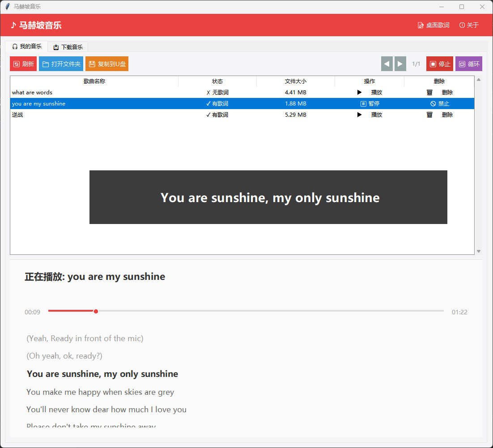
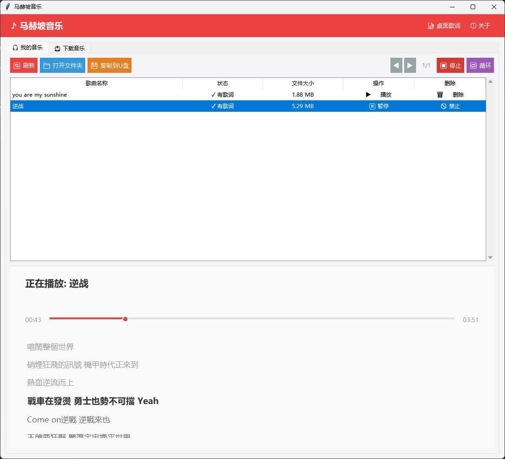
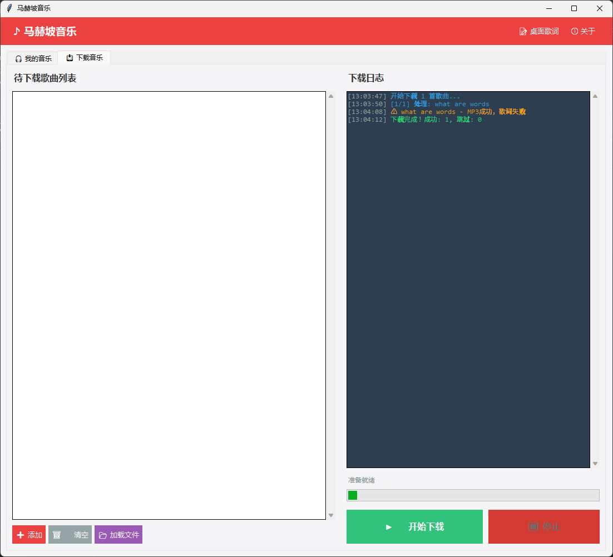

# 马赫坡音乐 🎵



自动下载音乐MP3文件和LRC歌词文件的工具，带GUI音乐播放器。
使用Selenium自动化从MP3Juice下载音乐，从LRCLib下载歌词。

## ✨ 核心特性

### 🎵 音乐播放
- ✅ 本地MP3音乐播放
- ✅ 播放/暂停/停止控制
- ✅ 列表循环播放，自动播放下一首
- ✅ LRC歌词实时同步显示
- ✅ 桌面歌词窗口（可拖动、半透明）
- ✅ 分页浏览（每页20首）
- ✅ 播放进度和时间显示

### 📥 音乐下载
- ✅ 批量添加歌曲到下载列表
- ✅ 自动下载MP3文件（从mp3juice.co）
- ✅ 自动下载同步歌词（从lrclib.net）
- ✅ 优先下载带时间轴的LRC歌词
- ✅ 已下载歌曲自动跳过
- ✅ 实时下载日志显示
- ✅ 成功/失败记录保存

### 🗂️ 文件管理
- ✅ 本地音乐列表管理
- ✅ 删除音乐文件（正在播放禁止删除）
- ✅ 一键复制音乐到U盘
- ✅ 自动检测可移动驱动器
- ✅ 批量文件复制进度显示

### 🎨 用户界面
- ✅ 网易云音乐风格设计
- ✅ 现代化扁平界面
- ✅ 标签页布局（我的音乐/下载音乐）
- ✅ 实时彩色日志显示
- ✅ 流畅的动画效果

### ⚡ 性能优化
- ✅ **超快启动速度 < 1秒**
- ✅ 延迟加载Selenium模块
- ✅ 延迟初始化Pygame
- ✅ 单实例运行（防止多开）
- ✅ 智能资源管理

## 📸 界面预览

### 主界面


### 桌面歌词界面


### 下载界面


## 🚀 快速开始

### 开发环境

#### 1. 初始化项目
```bash
# 双击运行初始化脚本（会自动安装依赖和下载Chrome）
init.bat
```

初始化脚本会自动完成：
- 安装Python依赖（selenium、pygame、mutagen等）
- 下载Chrome for Testing v141.0.7390.54 (约168MB)
- 下载ChromeDriver v141.0.7390.54 (约9.2MB)
- 创建必要的目录结构

#### 2. 运行开发版本
```bash
python music_downloader_gui.py
```

#### 3. 打包为exe
```bash
# 方式1: 直接打包（推荐）
pyinstaller music_downloader_gui.spec

# 方式2: 使用PyArmor混淆后打包
pyarmor gen -O obfuscated music_downloader_gui.py
pyinstaller music_downloader_gui.spec
```

生成的exe位于: `dist/马赫坡音乐/马赫坡音乐.exe`

### 用户使用

#### 下载音乐
1. 切换到"📥 下载音乐"标签页
2. 点击"➕ 添加"按钮或"📂 加载文件"
3. 输入歌曲名称（建议格式：歌名 - 歌手）
4. 点击"▶️ 开始下载"
5. 等待下载完成（已下载的歌曲会自动跳过）

#### 播放音乐
1. 切换到"🎧 我的音乐"标签页
2. 点击歌曲列表中的"▶️ 播放"按钮
3. 使用"⏸️ 暂停"或"⏹️ 停止"控制播放
4. 开启"🔁 循环"实现列表循环播放
5. 点击顶部"📝 桌面歌词"开启桌面歌词显示

#### 文件管理
- **刷新列表**: 点击"🔄 刷新"按钮
- **打开文件夹**: 点击"📁 打开文件夹"
- **复制到U盘**: 插入U盘，点击"💾 复制到U盘"
- **删除音乐**: 点击歌曲行的"🗑️ 删除"按钮（需确认）

## 📂 项目结构

```
MahepoMusic/
├── music_downloader_gui.py      # 主程序源代码（GUI版本）
├── music_downloader_gui.spec    # PyInstaller打包配置
├── README.md                     # 本文档
├── README.txt                    # 文本版说明
├── 使用说明.txt                  # 用户使用说明
├── init.bat                      # 初始化脚本
├── .gitignore                    # Git忽略规则
├── doc/                          # 文档和截图
│   ├── 1.png                     # 主界面截图
│   ├── 2.png                     # 播放界面截图
│   ├── 3.png                     # 下载界面截图
│   ├── 使用指南.txt
│   ├── 开发文档.txt
│   └── 故障排除.txt
└── chrome_bundle/                # Chrome浏览器和驱动（init.bat自动下载）
    ├── chrome-win64/             # Chrome for Testing
    └── chromedriver-win64/       # ChromeDriver

运行时生成：
├── build/                        # PyInstaller构建目录
└── dist/                         # 打包输出
    └── 马赫坡音乐/
        └── 马赫坡音乐.exe          # 可执行文件
        └── download/               # 下载的音乐和歌词
        └── todo-download.txt           # 待下载歌曲列表
        └── download-success.txt        # 下载成功记录
        └── download-err.txt            # 下载失败记录
        └── player_config.txt             # 播放器配置
```

## 🛠️ 技术栈

### 核心依赖
- **Python 3.7+** - 主要编程语言
- **tkinter** - GUI界面框架（Python自带）
- **pygame** - 音乐播放引擎
- **selenium** - 浏览器自动化
- **mutagen** - MP3元数据读取

### 开发工具
- **pyinstaller** - 打包exe
- **pyarmor** - 代码混淆（可选）

### 浏览器
- **Chrome for Testing v141.0.7390.54** (约168MB)
- **ChromeDriver v141.0.7390.54** (约9.2MB)

## 📖 详细文档

查看 `doc/` 目录获取更多信息：
- 📘 [使用指南](doc/使用指南.txt) - 详细的使用教程
- 📗 [开发文档](doc/开发文档.txt) - 开发者指南
- 📕 [故障排除](doc/故障排除.txt) - 常见问题解答
- 📋 [功能清单](功能清单.md) - 已实现和规划功能

## 🔧 开发说明

### Git仓库说明

**已提交的文件：**
- 源代码文件
- 文档和配置
- 界面截图

**已忽略的文件（.gitignore）：**
- `chrome_bundle/` - 体积大，通过init.bat下载
- `build/`, `dist/`, `obfuscated/` - 构建产物
- `download/` - 运行时文件
- `*.pyc`, `__pycache__/` - Python缓存

### 打包配置优化

当前打包配置已优化：
- **onedir模式** - 避免单文件解压延迟
- **字节码优化** - optimize=2
- **延迟加载** - Selenium和Pygame延迟导入
- **排除无用模块** - 减小体积
- **启动时间 < 1秒** ⚡

## 🎯 版本规划

### v1.0（当前版本）✅
- ✅ 基础播放功能
- ✅ 批量下载功能
- ✅ 本地音乐管理
- ✅ 桌面歌词显示
- ✅ U盘复制功能
- ✅ 超快启动速度

### v1.5（短期目标）🔄
- [ ] 进度条拖动跳转
- [ ] 音量控制
- [ ] 多主题支持
- [ ] 自定义播放列表

### v2.0（中期目标）🎯
- [ ] 多下载源支持
- [ ] 音质选择
- [ ] 元数据编辑
- [ ] 云同步功能

查看完整的功能规划：[功能清单.md](功能清单.md)

## 📜 许可证

本项目仅供学习交流使用。

**重要声明：**
- ⚠️ 请支持正版音乐
- ⚠️ 严禁用于商业盈利
- ⚠️ 严禁用于任何违法用途

## 👨‍💻 贡献

欢迎提交Issue和Pull Request！

## 📞 联系方式

- GitHub仓库: https://github.com/SinoDigify/MahepoMusic
- 问题反馈: [GitHub Issues](https://github.com/SinoDigify/MahepoMusic/issues)

---

**马赫坡音乐** - 让音乐下载和播放更简单 🎵
